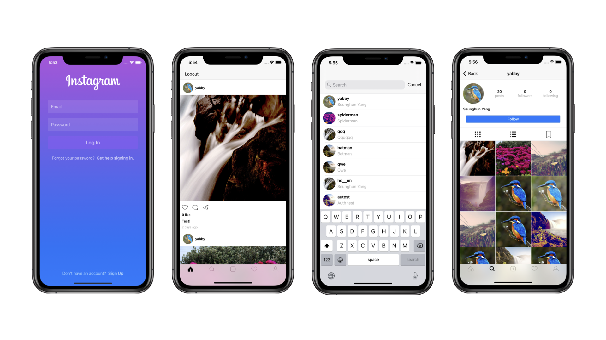

# Instagram Clone

> [Udemy 강의](https://www.udemy.com/share/103Ig0BkUSdF5UQXQ=/)를 수강하며 제작한 Instagram Clone 어플리케이션

## 개발 목표
MVVM 아키텍쳐를 익히기 위해 [Udemy 강의](https://www.udemy.com/share/103Ig0BkUSdF5UQXQ=/)를 수강하며 제작한 Instagram Clone 어플리케이션입니다.  

## 사용 라이브러리
+ [Firebase](https://github.com/firebase/firebase-ios-sdk) : Firebase 서비스를 이용하기위한 SDK
+ [SDWebImage](https://github.com/SDWebImage/SDWebImage) : 이미지 다운로드 및 캐시를 지원해주는 라이브러리
+ [YPImagePicker](https://github.com/Yummypets/YPImagePicker) : Instagram 스타일의 사진/비디오 picker 라이브러리
+ [JGProgressHUD](https://github.com/JonasGessner/JGProgressHUD) : 업로드 진행상황을 보여주기 위해 사용한 라이브러리

## To-do list
- [ ] 강의 모두 시청하며 따라 개발하기
- [ ] RxSwift 도입해 코드 개선해보기

## TMI
[노션](https://www.notion.so/yabby/Instagram-Clone-66c10a9d8d8d4369bd30bea031c45221)에서 개발 로그를 확인할 수 있습니다.